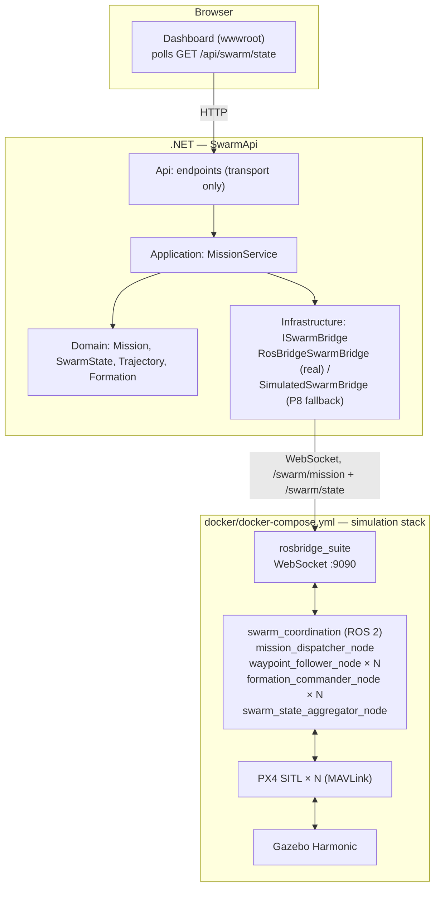

# swarmsim

[](https://github.com/konradcinkusz/swarmsim/actions/workflows/ci.yml)
[](https://konradcinkusz.github.io/swarmsim/)
[](https://github.com/konradcinkusz/swarmsim/releases)
[](LICENSE)

A drone-swarm simulation and coordination platform, built on existing open-source
flight-simulation engines — Gazebo, PX4 SITL, ROS 2 — rather than a custom physics
engine, with a .NET backend exposing mission-definition and swarm-state REST APIs as
the integration point for a future natural-language mission layer.

This repository covers the **foundational phase**: bring up a multi-drone simulation,
give it basic swarm coordination (waypoint following, leader-follower formation), and
put an API and a dashboard in front of it. A natural-language mission layer (M5) is
explicitly out of scope here — see [Milestones](#milestones).

**Docs site:** [konradcinkusz.github.io/swarmsim](https://konradcinkusz.github.io/swarmsim/)
— rendered architecture docs, ADRs, and the open-deviations register. This README stays
the single source of truth for "how do I run this"; the docs site is for the reasoning
behind how it's built.

## Architecture



Two composition roots, one per layer, and why — see
[`docs/adr/0002-composition-root-split.md`](docs/adr/0002-composition-root-split.md):

- **`docker/docker-compose.yml`** brings up the simulation stack, *and* the API wired
  to it (`api` service) — one command for the whole thing.
- **`dotnet run --project backend/src/SwarmApi.Api`** brings up the API alone — no
  simulation stack required: with `RosBridge:Url` unset or unreachable, it falls back
  to a deterministic in-memory swarm (see
  [`docs/adr/0003-rosbridge-degrade-pattern.md`](docs/adr/0003-rosbridge-degrade-pattern.md)).

There is **no .NET Aspire AppHost** yet — a deliberate, recorded deviation, not an
oversight; see the ADR above for the reasoning and the trigger to add one.

Full architecture, the compliance checklist against
[`architecture-standards`](https://github.com/konradcinkusz/architecture-standards), and
every recorded deviation with its reasoning: [`docs/architecture/`](docs/architecture/)
(also on the [docs site](https://konradcinkusz.github.io/swarmsim/architecture/)).

## Milestones

| # | Scope | Status |
|---|---|---|
| M0 | Docker Compose environment; one drone (x500) spawns in Gazebo, responds to `commander takeoff` | Implemented; **runtime verified manually only** — see [note](#m0-manual-verification) |
| M1 | 3-5 PX4 SITL instances in one world, namespaced ROS 2 topics per drone | Implemented (`simulation/px4-configs/`, `docker/entrypoint.sh`); manual verification, same as M0 |
| M2 | Waypoint-following and leader-follower formation, no collisions | Implemented, unit tested (`swarm_coordination/`, `backend/.../Formation.cs`) |
| M3 | `POST /api/missions`, `GET /api/swarm/state`, < 1s state latency | Implemented, integration tested against the simulated bridge (`backend/tests/SwarmApi.Api.Tests`) |
| M4 | Real-time swarm status readable without a terminal | Implemented (`backend/src/SwarmApi.Api/wwwroot/`) |
| M5 | Natural-language mission layer | Out of scope for this repository's current phase |

<a name="m0-manual-verification"></a>
**Why "manually only":** `docker/Dockerfile.sim` compiles PX4 from source against
Gazebo and needs GPU/X11 access for its GUI acceptance criterion — no CI runner used by
this project has that today (see
[`docs/adr/0004-ci-scope-for-simulation-stack.md`](docs/adr/0004-ci-scope-for-simulation-stack.md)
for exactly what CI validates instead: Dockerfile lint, compose config, world file
well-formedness). M2's collision-avoidance and M3's API behavior, in contrast, are
fully covered by automated tests, because both are provable against pure logic and the
simulated bridge without needing Gazebo to actually be running. **If you run the M0/M1
walkthrough below yourself, consider filing a short issue or PR noting the result** —
that manual confirmation is the one acceptance criterion nothing in CI can give you.

## Quickstart

**Prerequisites:**

- Docker with Compose v2 (`docker compose version`) for the simulation stack
- .NET 8 SDK (`dotnet --version`) for the API, if running it outside Docker
- Linux, or Windows via WSL2 (Ubuntu 22.04/24.04)
- For the simulation GUI: X11 (native Linux) or WSLg (Windows 11 WSL2); check GPU
  support first with `vulkaninfo` or `glxinfo | grep OpenGL`. No GPU? Use headless
  mode below — the simulation still runs and answers MAVLink commands, just without a
  visible window.

### One drone in Gazebo (M0)

```bash
cd docker

# GUI mode (default) — needs X11/WSLg passthrough:
xhost +local:docker   # Linux only, allows the container to use your X server
docker compose up --build

# Headless mode — no GPU/display required, telemetry only:
HEADLESS=1 docker compose up --build
```

First build compiles PX4 from source against ROS 2 Humble and Gazebo Harmonic — this
is normal and can take 15-40 minutes the first time; subsequent runs reuse the image.

**Verify the drone responds to a command**, in a second terminal — each PX4 instance
runs in its own named `tmux` session (see `docker/entrypoint.sh`), so attaching reaches
the real interactive PX4 console (`pxh>`), not a backgrounded process with no console:

```bash
docker compose exec sim tmux attach -t drone_1
# at the pxh> prompt:
commander takeoff
# detach without stopping the drone: Ctrl+B, then D
```

You should see `drone_1` climb in the Gazebo window (GUI mode) or the console's
telemetry (headless mode) report an altitude change. That is M0's acceptance criterion,
met. (`docker compose exec sim tmux ls` lists every running instance's session name.)

**Multiple drones (M1):** `simulation/px4-configs/` ships five per-drone configs
(`drone_1.env` … `drone_5.env`); `docker/entrypoint.sh` spawns one PX4 SITL instance per
file it finds, already namespaced (`drone_1` … `drone_5`). Nothing to configure — it is
the same container image and command as M0, just with more `.env` files present. The
`api` service (below) comes up alongside it automatically from the same `docker compose up`.

### The API and dashboard (M3/M4)

No simulation stack required — the API falls back to a simulated swarm (P8):

```bash
cd backend
dotnet run --project src/SwarmApi.Api
```

Open `http://localhost:5000` (or the port `dotnet run` prints) for the dashboard, or:

```bash
curl -s http://localhost:5000/health | jq
curl -s -X POST http://localhost:5000/api/missions \
  -H 'Content-Type: application/json' \
  -d '{
        "name": "Perimeter sweep",
        "type": "waypoint",
        "waypoints": [{"x":0,"y":0,"z":5}, {"x":10,"y":0,"z":5}],
        "droneCount": 3,
        "spacingMeters": 2.0
      }' | jq

curl -s http://localhost:5000/api/swarm/state | jq
```

**Against a real simulation:** set `RosBridge__Url=ws://localhost:9090`, or just run
`docker compose up` in `docker/` — it wires this automatically (`api` service's
`RosBridge__Url=ws://sim:9090`). `GET /health` reports which mode is active
(`swarmBridge: "Connected" | "Simulated"`), and the dashboard's badge shows the same
thing.

## Tutorial: everything, step by step

A longer walkthrough for verifying the whole platform end to end, not just the fast path above.

1. **Clone and run the test suites** (no Docker, no GPU needed for this step):

   ```bash
   git clone https://github.com/konradcinkusz/swarmsim.git
   cd swarmsim

   cd backend && dotnet test SwarmPlatform.sln && cd ..
   cd swarm_coordination && pip install ruff pytest && ruff check . && pytest -v && cd ..
   ```

   Expect: all xUnit tests green, `31 passed` from pytest. This proves the waypoint/
   formation math, mission validation, and the API's request/response contract — all
   without touching Gazebo.

2. **Run the API standalone** and confirm the P8 degrade path:

   ```bash
   cd backend && dotnet run --project src/SwarmApi.Api
   ```

   `curl -s http://localhost:5000/health` should report `"swarmBridge": "Simulated"` —
   confirming the zero-dependency fallback works before you ever touch Docker. Open
   the printed URL in a browser, click **Start demo mission**, and watch the table and
   plot update (polling every second).

3. **Bring up the real simulation stack** (needs Docker; GPU optional via `HEADLESS=1`):

   ```bash
   cd docker && docker compose up --build
   ```

   This starts `sim` (ROS 2 + PX4 SITL + Gazebo + rosbridge) **and** `api` (pointed at
   `ws://sim:9090`) together. Watch the `api` container's logs for
   `RosBridge reachable at ws://sim:9090; running in Connected mode.` — if you instead
   see the "unreachable... falling back to Simulated mode" warning, `sim` hasn't
   finished starting rosbridge yet (first boot can take a while — see step 4) or the
   compose network isn't up; recheck once `sim` is healthy.

4. **Verify M0** exactly as in the [Quickstart](#one-drone-in-gazebo-m0) above:
   attach to `drone_1`'s `tmux` session and run `commander takeoff`.

5. **Verify M3 against the real stack**: with `docker compose up` still running, from
   your host:

   ```bash
   curl -s http://localhost:8080/health | jq            # expect swarmBridge: "Connected"
   curl -s -X POST http://localhost:8080/api/missions -H 'Content-Type: application/json' -d '{
     "name": "Live sweep", "type": "waypoint",
     "waypoints": [{"x":0,"y":0,"z":5},{"x":10,"y":0,"z":5}],
     "droneCount": 1, "spacingMeters": 2.0
   }'
   ```

   This publishes to `/swarm/mission` over rosbridge; `mission_dispatcher_node` picks
   it up and publishes waypoints to `drone_1/mission/waypoints`, which
   `waypoint_follower_node` consumes at runtime (see
   `swarm_coordination/swarm_coordination/nodes/mission_dispatcher_node.py`). **This
   full path has never been run in this project's own CI or by the agent that wrote
   it** — it needs the GPU-capable machine this step assumes. If you run it, the
   result (worked / didn't) is worth reporting back.

6. **Multi-drone formation (M2)**: build the ROS 2 workspace and launch a formation
   mission — see [`swarm_coordination/README.md`](swarm_coordination/README.md) for the
   full `mavros` setup this needs (kept out of the Docker image deliberately; see that
   file for why).

### Troubleshooting

| Symptom | Cause | Fix |
|---|---|---|
| `docker: 'compose' is not a docker command` | Compose v1 (standalone) instead of v2 plugin | Install `docker-compose-plugin`, or use Docker Desktop ≥ 4.x |
| `Cannot connect to the Docker daemon` | Docker isn't running, or your user lacks permission | Start Docker; on Linux, add your user to the `docker` group and re-login |
| Gazebo window never appears (GUI mode) | X11/WSLg passthrough not set up | Run `xhost +local:docker` first (Linux); on Windows, confirm WSLg with `echo $DISPLAY` inside WSL2 — if empty, fall back to `HEADLESS=1` |
| `swarmBridge: "Simulated"` when you expected `"Connected"` | `RosBridge:Url` unset, or `sim` not finished starting rosbridge yet | Confirm `docker compose logs sim \| grep rosbridge`; wait for `starting rosbridge_websocket on :9090`; re-check `/health` |
| `bind: address already in use` on 8080/9090/5000 | Another process already holds that port | `lsof -i :8080` (or the relevant port) and stop it, or override the port in `docker-compose.yml` / `dotnet run --urls` |
| `NETSDK1045: The current .NET SDK does not support targeting .NET 8.0` | Wrong/older .NET SDK installed | Install the .NET 8 SDK (`dotnet --list-sdks` to check) |
| `ModuleNotFoundError: No module named 'rclpy'` running `pytest` | Tried to import `nodes/*.py` directly, or ran outside `swarm_coordination/` | Unit tests only ever import the pure `trajectory`/`waypoints`/`formation`/`mission_planning` modules — run `pytest` from `swarm_coordination/`, not against `nodes/` |
| `docker compose exec sim tmux attach -t drone_1` → `can't find session` | `sim` hasn't spawned that instance, or is still building | `docker compose exec sim tmux ls` to see what's actually running; check `docker compose logs sim` for spawn errors |

## Repository layout

| Path | What it is |
|---|---|
| `docker/` | Composition root for the simulation stack (Gazebo/PX4/ROS 2) + the API's Dockerfile |
| `simulation/` | Gazebo worlds, per-drone PX4 SITL configs |
| `swarm_coordination/` | ROS 2 (ament_python) package: waypoint/formation logic + node adapters |
| `backend/` | .NET solution: `SwarmApi.Domain/Application/Infrastructure/ServiceDefaults/Api` |
| `docs/adr/` | Architectural decision records |
| `docs/architecture/` | Compliance checklist against `architecture-standards`, open deviations register |
| `mkdocs.yml`, `docs/index.md` | Source for the [docs site](https://konradcinkusz.github.io/swarmsim/) (built by `.github/workflows/pages.yml`) |

## Packages and dependencies

Per-project dependency counts, published so a number that changes is something a
reviewer can ask about (`architecture-standards` REPO-BASELINE §4b).

**Backend (`backend/`, NuGet, centrally managed in `Directory.Packages.props`):**

| Project | Runtime deps | Notes |
|---|---|---|
| `SwarmApi.Domain` | 0 | Pure C#, no packages |
| `SwarmApi.Application` | 0 | Pure C#, no packages |
| `SwarmApi.Infrastructure` | 0 (packages) | `FrameworkReference: Microsoft.AspNetCore.App` for DI/Config/Logging abstractions + `System.Net.WebSockets` (BCL) |
| `SwarmApi.ServiceDefaults` | 0 (packages) | Same `FrameworkReference` as above |
| `SwarmApi.Api` | 0 | ASP.NET Core minimal APIs only |
| Test projects (×3) | 5 shared | `Microsoft.NET.Test.Sdk`, `xunit`, `xunit.runner.visualstudio`, `Microsoft.AspNetCore.Mvc.Testing`, `coverlet.collector` — test tooling only |

Runtime code ships **zero third-party NuGet packages**. Everything it uses (minimal
APIs, `System.Net.WebSockets.ClientWebSocket`, health checks, `System.Text.Json`) is in
the ASP.NET Core shared framework or the BCL.

**`swarm_coordination/` (ROS 2 ament_python package, `package.xml`):**

| Kind | Packages |
|---|---|
| Runtime (from the ROS 2 apt distro, not pip) | `rclpy`, `geometry_msgs`, `mavros_msgs`, `std_msgs` |
| Dev/test (pip) | `ruff`, `pytest` |

The pure-logic modules (`trajectory.py`, `waypoints.py`, `formation.py`,
`mission_planning.py`) import **none** of the above — that's what lets CI test them
with just `pip install ruff pytest`.

**Container base images:**

| Image | Used in |
|---|---|
| `ros:humble-ros-base` | `docker/Dockerfile.sim` (both stages) |
| `mcr.microsoft.com/dotnet/sdk:8.0` → `mcr.microsoft.com/dotnet/aspnet:8.0` | `docker/Dockerfile.api` (multi-stage) |

## Releases

Tagged releases live on the [Releases page](https://github.com/konradcinkusz/swarmsim/releases),
built automatically by `.github/workflows/release.yml` when a `vX.Y.Z` tag is pushed —
release notes are generated from merged PRs since the previous tag. There is no
deployed environment yet (see `docs/architecture/DEVIATIONS.md` — no Fly.io/Azure
target is part of this phase); a "release" here means a stable point in this repository's
history, not a shipped artifact.

## Development

```bash
# .NET
cd backend && dotnet test SwarmPlatform.sln

# Python (swarm_coordination pure logic; no ROS 2 install required)
cd swarm_coordination && ruff check . && pytest

# Simulation config (no GPU/build required)
docker compose -f docker/docker-compose.yml config -q

# Docs site (no GPU/build required)
pip install mkdocs-material && mkdocs build --strict
```

All four run in CI on every push and pull request (`.github/workflows/ci.yml`), along
with Dockerfile linting (`hadolint`) and secret scanning (`gitleaks`).

## Standards

This repository follows
[`konradcinkusz/architecture-standards`](https://github.com/konradcinkusz/architecture-standards)
where it applies to a robotics simulation platform, and documents every place it
deliberately doesn't — see [`docs/architecture/`](docs/architecture/) and
[`docs/adr/`](docs/adr/) for the reasoning behind each decision, not just the outcome.

## License

MIT — see [`LICENSE`](LICENSE).
