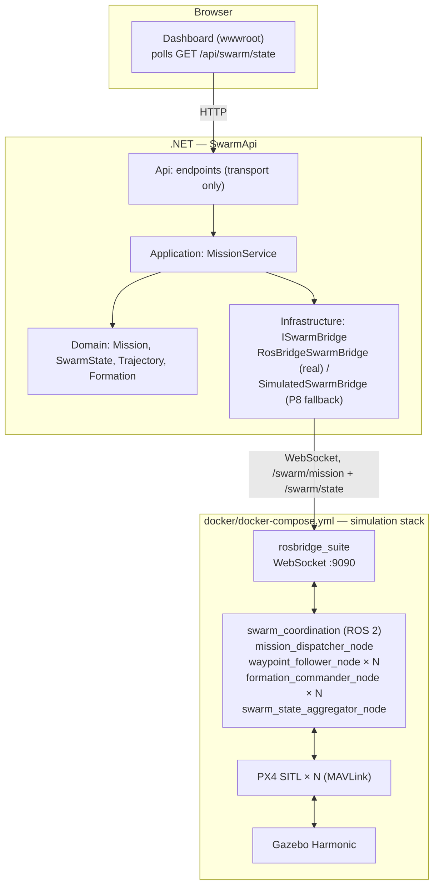

# swarmsim

[](https://github.com/konradcinkusz/swarmsim/actions/workflows/ci.yml)
[](https://konradcinkusz.github.io/swarmsim/)
[](LICENSE)

A drone-swarm simulation and coordination platform, built on existing open-source
flight-simulation engines — Gazebo, PX4 SITL, ROS 2 — rather than a custom physics
engine, with a .NET backend exposing mission-definition and swarm-state REST APIs as
the integration point for a future natural-language mission layer.

This repository covers the **foundational phase**: bring up a multi-drone simulation,
give it basic swarm coordination (waypoint following, leader-follower formation), and
put an API and a dashboard in front of it. A natural-language mission layer (M5) is
explicitly out of scope here — see [Milestones](#milestones).

**Docs site:** [konradcinkusz.github.io/swarmsim](https://konradcinkusz.github.io/swarmsim/)
— rendered architecture docs, ADRs, and the open-deviations register. This README stays
the single source of truth for "how do I run this"; the docs site is for the reasoning
behind how it's built.

## Architecture



Two composition roots, one per layer, and why — see
[`docs/adr/0002-composition-root-split.md`](docs/adr/0002-composition-root-split.md):

- **`docker/docker-compose.yml`** brings up the simulation stack, *and* the API wired
  to it (`api` service) — one command for the whole thing.
- **`dotnet run --project backend/src/SwarmApi.Api`** brings up the API alone — no
  simulation stack required: with `RosBridge:Url` unset or unreachable, it falls back
  to a deterministic in-memory swarm (see
  [`docs/adr/0003-rosbridge-degrade-pattern.md`](docs/adr/0003-rosbridge-degrade-pattern.md)).

There is **no .NET Aspire AppHost** yet — a deliberate, recorded deviation, not an
oversight; see the ADR above for the reasoning and the trigger to add one.

Full architecture, the compliance checklist against
[`architecture-standards`](https://github.com/konradcinkusz/architecture-standards), and
every recorded deviation with its reasoning: [`docs/architecture/`](docs/architecture/)
(also on the [docs site](https://konradcinkusz.github.io/swarmsim/architecture/)).

## Milestones

| # | Scope | Status |
|---|---|---|
| M0 | Docker Compose environment; one drone (x500) spawns in Gazebo, responds to `commander takeoff` | Implemented; **not yet verified by any run** — see [note](#m0-manual-verification) |
| M1 | 3-5 PX4 SITL instances in one world, namespaced ROS 2 topics per drone | Implemented (`simulation/px4-configs/`, `docker/entrypoint.sh`); not yet verified by any run, same as M0 |
| M2 | Waypoint-following and leader-follower formation, no collisions | Implemented, unit tested (`swarm_coordination/`, `backend/.../Formation.cs`) |
| M3 | `POST /api/missions`, `GET /api/swarm/state`, < 1s state latency | Implemented, integration tested against the simulated bridge (`backend/tests/SwarmApi.Api.Tests`) |
| M4 | Real-time swarm status readable without a terminal | Implemented (`backend/src/SwarmApi.Api/wwwroot/`) |
| M5 | Natural-language mission layer | Out of scope for this repository's current phase |

<a name="m0-manual-verification"></a>
**Why "not yet verified":** until 2026-09-22 this stack could not have run from a clone
at all — the per-drone configs had never been committed (a blanket `*.env` ignore rule
swallowed them) and the image build started the simulator instead of compiling it. Both
are fixed, and CI now checks the configs' presence, the compose file, the world file and
the entrypoint's logic against stubs, but nothing yet builds `docker/Dockerfile.sim` and
flies a drone (see
[`docs/adr/0004-ci-scope-for-simulation-stack.md`](docs/adr/0004-ci-scope-for-simulation-stack.md)
and the P13 row in [`docs/architecture/DEVIATIONS.md`](docs/architecture/DEVIATIONS.md)).
M2's formation math and M3's API behaviour, in contrast, are covered by automated tests
against pure logic and the simulated bridge. **If you run the M0/M1 walkthrough below,
please report the result in an issue** — until a SITL job exists, that is the only
evidence these rows can have.

## Quickstart

**Prerequisites:**

- Docker with Compose v2 (`docker compose version`) for the simulation stack
- .NET 8 SDK (`dotnet --version`) for the API, if running it outside Docker
- Linux, or Windows via WSL2 (Ubuntu 22.04/24.04)
- Nothing else for the default, headless stack — no GPU, no display.
- Only for the optional Gazebo GUI: X11 (native Linux) or WSLg (Windows 11 WSL2), and a
  GPU exposed as `/dev/dri` (check with `glxinfo | grep OpenGL`).

`./scripts/setup.sh` checks all of the above, installs the pre-commit secret-scan hook,
and says which parts of the repository each missing prerequisite would lock you out of.

### One drone in Gazebo (M0)

```bash
cd docker

# Headless (default) — Gazebo server only, runs anywhere Docker does:
SWARM_DRONE_COUNT=1 docker compose up --build

# With the Gazebo GUI — needs X11/WSLg and /dev/dri, added by the override file:
xhost +local:docker   # Linux only, allows the container to use your X server
SWARM_DRONE_COUNT=1 docker compose -f docker-compose.yml -f docker-compose.gui.yml up --build
```

First build compiles PX4 from source against ROS 2 Humble and Gazebo Harmonic — this
is normal and can take 15-40 minutes the first time; subsequent runs reuse the image.

**Verify the drone responds to a command**, in a second terminal — each PX4 instance
runs in its own named `tmux` session (see `docker/entrypoint.sh`), so attaching reaches
the real interactive PX4 console (`pxh>`), not a backgrounded process with no console:

```bash
docker compose exec sim tmux attach -t drone_1
# at the pxh> prompt:
commander takeoff
# detach without stopping the drone: Ctrl+B, then D
```

You should see `drone_1` climb in the Gazebo window (GUI mode), or — headless — confirm
it at the same console with `listener vehicle_local_position` (`z` goes negative: PX4's
local frame is NED, so up is minus). That is M0's acceptance criterion. `docker compose
exec sim tmux ls` lists every running instance's session; each pane is also mirrored to
`/tmp/swarmsim/<session>.log` inside the container.

**Multiple drones (M1):** `simulation/px4-configs/` holds five per-drone configs
(`drone_1.env` … `drone_5.env`, 3 m apart along +y); `docker/entrypoint.sh` starts one
Gazebo server and one PX4 SITL instance per config, each in its own session
(`drone_1` … `drone_5`). Leave `SWARM_DRONE_COUNT` unset for all five. The `api`
service (below) comes up from the same `docker compose up`, once rosbridge is healthy.

### The API and dashboard (M3/M4)

No simulation stack required — the API falls back to a simulated swarm (P8):

```bash
cd backend
dotnet run --project src/SwarmApi.Api
```

Open `http://localhost:5000` (or the port `dotnet run` prints) for the dashboard, or:

```bash
curl -s http://localhost:5000/health | jq
curl -s -X POST http://localhost:5000/api/missions \
  -H 'Content-Type: application/json' \
  -d '{
        "name": "Perimeter sweep",
        "type": "waypoint",
        "waypoints": [{"x":0,"y":0,"z":5}, {"x":10,"y":0,"z":5}],
        "droneCount": 3,
        "spacingMeters": 2.0
      }' | jq

curl -s http://localhost:5000/api/swarm/state | jq
```

**Against a real simulation:** set `RosBridge__Url=ws://localhost:9090`, or just run
`docker compose up` in `docker/` — it wires this automatically (`api` service's
`RosBridge__Url=ws://sim:9090`, started only once the `sim` healthcheck sees rosbridge).
`GET /health` reports which mode is active (`swarmBridge: "Connected" | "Simulated"`),
and the dashboard's badge shows the same thing. The mode is chosen once, at startup; a
connection that drops later is not yet reflected there (P8 row in
[`DEVIATIONS.md`](docs/architecture/DEVIATIONS.md)).

### Authentication (optional)

`Auth:Authority` unset (the default above) runs `SwarmApi.Api` in **Open** mode — every
endpoint reachable with no token, exactly as in the two sections above. Set it to an
[`authservice`](https://github.com/konradcinkusz/authservice) instance's base URL to
switch to **Enforced** mode, which requires a valid bearer token (RS256, validated via
that service's JWKS) on `POST /api/missions` — the mutating endpoint an MCP-driven Agent
would call. `GET /health` reports which mode is active (`auth: "Open" | "Enforced"`).
See [`docs/adr/0005-mcp-server-and-bearer-auth.md`](docs/adr/0005-mcp-server-and-bearer-auth.md)
for the reasoning and exact scope, and `docker compose --profile auth up` in `docker/`
to run a local `authservice` instance alongside the stack (needs a generated signing key
first — see that profile's comments in `docker/docker-compose.yml`). That local instance
serves plain http, so pair `SWARM_AUTH_AUTHORITY=http://authservice:8080` with
`SWARM_AUTH_REQUIRE_HTTPS_METADATA=false` (both in `docker/.env.example`); outside a
private network, keep the https default.

### MCP server

[`mcp_server/`](mcp_server/README.md) exposes `get_swarm_status` and `start_mission` as
MCP tools over this same REST API — no new ROS 2 bridge, swarm-level by construction
since it wraps the existing `Mission`/`SwarmState` domain layer rather than per-drone ROS
topics. See that directory's README for tool details and client configuration.

## Tutorial: everything, step by step

A longer walkthrough for verifying the whole platform end to end, not just the fast path above.

1. **Clone and run the test suites** (no Docker, no GPU needed for this step):

   ```bash
   git clone https://github.com/konradcinkusz/swarmsim.git
   cd swarmsim

   cd backend && dotnet test SwarmPlatform.sln && cd ..
   cd swarm_coordination && pip install ruff pytest && ruff check . && pytest -v && cd ..
   ```

   Expect every suite green. This proves the waypoint/formation math, the scenario
   library, mission validation, and the API's request/response and auth contract — all
   without touching Gazebo.

2. **Run the API standalone** and confirm the P8 degrade path:

   ```bash
   cd backend && dotnet run --project src/SwarmApi.Api
   ```

   `curl -s http://localhost:5000/health` should report `"swarmBridge": "Simulated"` —
   confirming the zero-dependency fallback works before you ever touch Docker. Open
   the printed URL in a browser, click **Start demo mission**, and watch the table and
   plot update (polling every second).

3. **Bring up the real simulation stack** (needs Docker; GPU optional via `HEADLESS=1`):

   ```bash
   cd docker && docker compose up --build
   ```

   This starts `sim` (ROS 2 + PX4 SITL + Gazebo + rosbridge) and then `api` (pointed at
   `ws://sim:9090`) once `sim`'s healthcheck sees rosbridge accepting connections. Watch
   the `api` container's logs for
   `RosBridge reachable at ws://sim:9090; running in Connected mode.` If you still see the
   "unreachable... falling back to Simulated mode" warning, the choice has been made for
   this process's lifetime: `docker compose restart api` once `sim` is healthy.

4. **Verify M0** exactly as in the [Quickstart](#one-drone-in-gazebo-m0) above:
   attach to `drone_1`'s `tmux` session and run `commander takeoff`.

5. **Verify M3 against the real stack**: with `docker compose up` still running, from
   your host:

   ```bash
   curl -s http://localhost:8080/health | jq            # expect swarmBridge: "Connected"
   curl -s -X POST http://localhost:8080/api/missions -H 'Content-Type: application/json' -d '{
     "name": "Live sweep", "type": "waypoint",
     "waypoints": [{"x":0,"y":0,"z":5},{"x":10,"y":0,"z":5}],
     "droneCount": 1, "spacingMeters": 2.0
   }'
   ```

   This publishes to `/swarm/mission` over rosbridge. **Nothing in the compose stack
   subscribes to it yet:** the `swarm_coordination` nodes that would pick it up
   (`mission_dispatcher_node`, `swarm_state_aggregator_node`) and the MAVROS bridges they
   need are not part of the `sim` image, so the mission reaches rosbridge and stops there,
   and `GET /api/swarm/state` reports no drones. Running them means building the ROS 2
   workspace yourself — step 6. Closing that gap is the next piece of work on the
   simulation layer; until then, this step proves the API ↔ rosbridge wiring and nothing
   beyond it.

6. **Multi-drone formation (M2)**: build the ROS 2 workspace and launch a formation
   mission — see [`swarm_coordination/README.md`](swarm_coordination/README.md) for the
   full `mavros` setup this needs (kept out of the Docker image deliberately; see that
   file for why).

### Troubleshooting

| Symptom | Cause | Fix |
|---|---|---|
| `docker: 'compose' is not a docker command` | Compose v1 (standalone) instead of v2 plugin | Install `docker-compose-plugin`, or use Docker Desktop ≥ 4.x |
| `Cannot connect to the Docker daemon` | Docker isn't running, or your user lacks permission | Start Docker; on Linux, add your user to the `docker` group and re-login |
| Gazebo window never appears (GUI mode) | GUI override not used, or X11/WSLg passthrough not set up | Use `-f docker-compose.yml -f docker-compose.gui.yml`; run `xhost +local:docker` first (Linux); on Windows, confirm WSLg with `echo $DISPLAY` inside WSL2 — if empty, stay headless |
| `error gathering device information ... /dev/dri` | The GUI override needs a GPU exposed as `/dev/dri` | Drop the override: the default stack is headless and needs no device |
| `sim` exits with `no drone_*.env found` | A checkout from before 2026-09-22, when the drone configs were not in the repository | Pull `main`; `ls simulation/px4-configs/` should list `drone_1.env` … `drone_5.env` |
| `swarmBridge: "Simulated"` when you expected `"Connected"` | `RosBridge:Url` unset, or the API started before rosbridge was up | The bridge is chosen once per process: `docker compose restart api` after `docker compose ps` shows `sim` healthy |
| `bind: address already in use` on 8080/9090/5000 | Another process already holds that port | `lsof -i :8080` (or the relevant port) and stop it, or override the port in `docker-compose.yml` / `dotnet run --urls` |
| `NETSDK1045: The current .NET SDK does not support targeting .NET 8.0` | Wrong/older .NET SDK installed | Install the .NET 8 SDK (`dotnet --list-sdks` to check) |
| `ModuleNotFoundError: No module named 'rclpy'` running `pytest` | Tried to import `nodes/*.py` directly, or ran outside `swarm_coordination/` | Unit tests only ever import the pure `trajectory`/`waypoints`/`formation`/`mission_planning` modules — run `pytest` from `swarm_coordination/`, not against `nodes/` |
| `docker compose exec sim tmux attach -t drone_1` → `can't find session` | `sim` hasn't spawned that instance, or is still building | `docker compose exec sim tmux ls` to see what's actually running; check `docker compose logs sim` for spawn errors |

## Repository layout

| Path | What it is |
|---|---|
| `docker/` | Composition root for the simulation stack (Gazebo/PX4/ROS 2), its GUI override, the API's Dockerfile, and a stub-based test of the entrypoint |
| `simulation/` | Gazebo worlds, per-drone PX4 SITL configs |
| `swarm_coordination/` | ROS 2 (ament_python) package: waypoint/formation logic + node adapters, and the scenario library (`swarm_coordination/scenarios/`) |
| `backend/` | .NET solution: `SwarmApi.Domain/Application/Infrastructure/ServiceDefaults/Api` |
| `mcp_server/` | MCP server exposing swarm-level tools over `SwarmApi.Api`'s REST surface — no ROS dependency |
| `action.yml` | Proof-of-concept GitHub Action: submits a mission to a running `SwarmApi.Api` and polls its state |
| `scripts/` | `setup.sh` (onboarding), `scan-secrets.sh` (local mirror of the CI secret scan), `hooks/pre-commit` |
| `docs/adr/` | Architectural decision records |
| `docs/architecture/` | Compliance checklist against `architecture-standards`, open deviations register |
| `mkdocs.yml`, `docs/index.md` | Source for the [docs site](https://konradcinkusz.github.io/swarmsim/) (built by `.github/workflows/pages.yml`) |

## Packages and dependencies

Per-project dependency counts, published so a number that changes is something a
reviewer can ask about (`architecture-standards` REPO-BASELINE §4b).

**Backend (`backend/`, NuGet, centrally managed in `Directory.Packages.props`):**

| Project | Runtime deps | Notes |
|---|---|---|
| `SwarmApi.Domain` | 0 | Pure C#, no packages |
| `SwarmApi.Application` | 0 | Pure C#, no packages |
| `SwarmApi.Infrastructure` | 1 | `FrameworkReference: Microsoft.AspNetCore.App` for DI/Config/Logging abstractions + `System.Net.WebSockets` (BCL), plus `Microsoft.AspNetCore.Authentication.JwtBearer` (see below) |
| `SwarmApi.ServiceDefaults` | 0 (packages) | Same `FrameworkReference` as above |
| `SwarmApi.Api` | 0 | ASP.NET Core minimal APIs only |
| Test projects (×3) | 5 shared | `Microsoft.NET.Test.Sdk`, `xunit`, `xunit.runner.visualstudio`, `Microsoft.AspNetCore.Mvc.Testing`, `coverlet.collector` — test tooling only |

Runtime code ships **one third-party NuGet package**, a deliberate, recorded exception —
[`docs/adr/0005-mcp-server-and-bearer-auth.md`](docs/adr/0005-mcp-server-and-bearer-auth.md).
Everything else (minimal APIs, `System.Net.WebSockets.ClientWebSocket`, health checks,
`System.Text.Json`) is in the ASP.NET Core shared framework or the BCL.

**`mcp_server/` (Python, `pyproject.toml`):**

| Kind | Packages |
|---|---|
| Runtime | `mcp` |
| Dev/test (pip) | `ruff`, `pytest` |

Only `swarm_client.py` (pure request-building) needs neither `mcp` nor a network
connection — the same pure/adapter split as `swarm_coordination`.

**`swarm_coordination/` (ROS 2 ament_python package, `package.xml`):**

| Kind | Packages |
|---|---|
| Runtime (from the ROS 2 apt distro, not pip) | `rclpy`, `geometry_msgs`, `mavros_msgs`, `std_msgs` |
| Dev/test (pip) | `ruff`, `pytest` |

The pure-logic modules (`trajectory.py`, `waypoints.py`, `formation.py`,
`mission_planning.py`) import **none** of the above — that's what lets CI test them
with just `pip install ruff pytest`.

**Container base images:**

| Image | Used in |
|---|---|
| `ros:humble-ros-base` | `docker/Dockerfile.sim` (both stages) |
| `mcr.microsoft.com/dotnet/sdk:10.0` → `mcr.microsoft.com/dotnet/aspnet:8.0` | `docker/Dockerfile.api` (multi-stage: the newer SDK builds the `net8.0` target; the runtime major matches the TFM, per P6) |

## Releases

Releases are built by `.github/workflows/release.yml` when a `vX.Y.Z` tag is pushed —
release notes are generated from merged PRs since the previous tag. **No tag has been cut
yet**, so there is no release and no release badge; the first one is due once the
simulation stack has been verified by an actual run. There is no
deployed environment yet (see `docs/architecture/DEVIATIONS.md` — no Fly.io/Azure
target is part of this phase); a "release" here means a stable point in this repository's
history, not a shipped artifact.

## Development

```bash
# .NET
cd backend && dotnet test SwarmPlatform.sln

# Python (swarm_coordination pure logic; no ROS 2 install required)
cd swarm_coordination && ruff check . && pytest

# Python (mcp_server; no `mcp` install required for the tested module)
cd mcp_server && ruff check . && pytest

# Simulation config and entrypoint logic (no GPU/build required)
docker compose -f docker/docker-compose.yml config -q
docker compose -f docker/docker-compose.yml --profile auth config -q
DISPLAY=:0 docker compose -f docker/docker-compose.yml -f docker/docker-compose.gui.yml config -q
shellcheck docker/entrypoint.sh scripts/*.sh && bash docker/tests/test_entrypoint.sh

# Secret scan, exactly as CI runs it (full history)
./scripts/scan-secrets.sh

# Docs site (no GPU/build required)
pip install mkdocs-material && mkdocs build --strict
```

All of the above run in CI on every push and pull request (`.github/workflows/ci.yml`),
along with Dockerfile linting (`hadolint`), an architecture test and size ceiling for the
shared kernel, and secret scanning over the full git history (`gitleaks`).

## Standards

This repository follows
[`konradcinkusz/architecture-standards`](https://github.com/konradcinkusz/architecture-standards)
where it applies to a robotics simulation platform, and documents every place it
deliberately doesn't — see [`docs/architecture/`](docs/architecture/) and
[`docs/adr/`](docs/adr/) for the reasoning behind each decision, not just the outcome.

## License

MIT — see [`LICENSE`](LICENSE).
