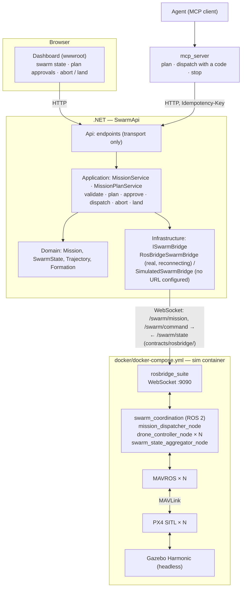

# swarmsim

[](https://github.com/konradcinkusz/swarmsim/actions/workflows/ci.yml)
[](https://konradcinkusz.github.io/swarmsim/)
[](LICENSE)

A drone-swarm simulation and coordination platform, built on existing open-source
flight-simulation engines — Gazebo, PX4 SITL, ROS 2 — rather than a custom physics
engine, with a .NET backend exposing mission-definition and swarm-state REST APIs as
the integration point for a future natural-language mission layer.

This repository covers the **foundational phase**: bring up a multi-drone simulation,
give it basic swarm coordination (waypoint following, leader-follower formation), and
put an API and a dashboard in front of it. A natural-language mission layer (M5) is not
built here; the gate such a layer has to go through is — an agent can propose a mission,
but only a person's approval makes it fly ([MCP server](#mcp-server)).

**Docs site:** [konradcinkusz.github.io/swarmsim](https://konradcinkusz.github.io/swarmsim/)
— rendered architecture docs, ADRs, and the open-deviations register. This README stays
the single source of truth for "how do I run this"; the docs site is for the reasoning
behind how it's built.

## Architecture



Two composition roots, one per layer, and why — see
[`docs/adr/0002-composition-root-split.md`](docs/adr/0002-composition-root-split.md):

- **`docker/docker-compose.yml`** brings up the simulation stack, *and* the API wired
  to it (`api` service) — one command for the whole thing.
- **`dotnet run --project backend/src/SwarmApi.Api`** brings up the API alone — no
  simulation stack required: with `RosBridge:Url` unset, it runs a deterministic
  in-memory swarm. With it set, the API always uses the real swarm, and while rosbridge
  is unreachable says so (`Disconnected`, HTTP 503 on writes) instead of substituting
  the simulated one (see
  [`docs/adr/0003-rosbridge-degrade-pattern.md`](docs/adr/0003-rosbridge-degrade-pattern.md)).

There is **no .NET Aspire AppHost** yet — a deliberate, recorded deviation, not an
oversight; see the ADR above for the reasoning and the trigger to add one.

Full architecture, the compliance checklist against
[`architecture-standards`](https://github.com/konradcinkusz/architecture-standards), and
every recorded deviation with its reasoning: [`docs/architecture/`](docs/architecture/)
(also on the [docs site](https://konradcinkusz.github.io/swarmsim/architecture/)).

## Milestones

| # | Scope | Status |
|---|---|---|
| M0 | Docker Compose environment; one drone (x500) spawns in Gazebo, responds to `commander takeoff` | Implemented; flown by the SITL smoke job — see [note](#m0-manual-verification) |
| M1 | 3-5 PX4 SITL instances in one world, namespaced ROS 2 topics per drone | Implemented (`simulation/px4-configs/`, `docker/entrypoint.sh`); the SITL smoke job flies three |
| M2 | Waypoint-following and leader-follower formation, no collisions | Implemented, unit tested (`swarm_coordination/`, `backend/.../Formation.cs`); the SITL smoke job flies waypoint lanes and a line formation |
| M3 | Missions in (`POST /api/missions`, abort, land-all), swarm state out (`GET /api/swarm/state`), < 1s state latency | Implemented; integration tested against the simulated swarm and an in-process rosbridge; flown end to end by the SITL smoke job, p95 state age 0.2 s |
| M4 | Real-time swarm status readable without a terminal | Implemented (`backend/src/SwarmApi.Api/wwwroot/`) |
| M5 | Natural-language mission layer | Not built. What is built is its gate: an agent plans through MCP, a person approves, only the approval's single-use code flies it ([ADR-0009](docs/adr/0009-agent-write-gate.md)); no language model ships here |

<a name="m0-manual-verification"></a>
**What "flown by the SITL smoke job" means:** `.github/workflows/sim-smoke.yml` builds
`docker/Dockerfile.sim`, starts the compose stack with three drones on a stock GitHub
runner (headless, CPU only) and runs `docker/tests/sitl_smoke.py` against the API: every
drone reported on its pad, a waypoint mission flown to completion and landed where it
should, a formation mission aborted into a landing, and the age of the swarm state
measured against M3's one-second budget. It runs on pull requests that touch what the
image or the API is built from, nightly, and on demand. It first passed on 2026-09-22
([run](https://github.com/konradcinkusz/swarmsim/actions/runs/35796734843)). The
waypoint mission flew and landed in 28 s, and the p95 state age at the API was 0.2 s.
The aborted formation was on the ground 14 s after the abort. What it took to get there
is in
[`docs/adr/0004-ci-scope-for-simulation-stack.md`](docs/adr/0004-ci-scope-for-simulation-stack.md):
nothing below the SITL layer had caught any of it.
The Gazebo GUI stays a manual check: **if you run the GUI walkthrough below, please
report the result in an issue.**

## Quickstart

**Prerequisites:**

- Docker with Compose v2 (`docker compose version`) for the simulation stack
- .NET 8 SDK (`dotnet --version`) for the API, if running it outside Docker
- Linux, or Windows via WSL2 (Ubuntu 22.04/24.04)
- Nothing else for the default, headless stack — no GPU, no display.
- Only for the optional Gazebo GUI: X11 (native Linux) or WSLg (Windows 11 WSL2), and a
  GPU exposed as `/dev/dri` (check with `glxinfo | grep OpenGL`).

`./scripts/setup.sh` checks all of the above, installs the pre-commit secret-scan hook,
and says which parts of the repository each missing prerequisite would lock you out of.

### One drone in Gazebo (M0)

```bash
cd docker

# Headless (default) — Gazebo server only, runs anywhere Docker does:
SWARM_DRONE_COUNT=1 docker compose up --build

# With the Gazebo GUI — needs X11/WSLg and /dev/dri, added by the override file:
xhost +local:docker   # Linux only, allows the container to use your X server
SWARM_DRONE_COUNT=1 docker compose -f docker-compose.yml -f docker-compose.gui.yml up --build
```

First build compiles PX4 from source against ROS 2 Humble and Gazebo Harmonic — this
is normal and can take 30-60 minutes the first time; subsequent runs reuse the image.
`SWARM_COORDINATION=0` starts PX4 without MAVROS and the coordination nodes, if all you
want is the bare console below.

**Verify the drone responds to a command**, in a second terminal — each PX4 instance
runs in its own named `tmux` session (see `docker/entrypoint.sh`), so attaching reaches
the real interactive PX4 console (`pxh>`), not a backgrounded process with no console:

```bash
docker compose exec sim tmux attach -t drone_1
# at the pxh> prompt:
commander takeoff
# detach without stopping the drone: Ctrl+B, then D
```

You should see `drone_1` climb in the Gazebo window (GUI mode), or — headless — confirm
it at the same console with `listener vehicle_local_position` (`z` goes negative: PX4's
local frame is NED, so up is minus). That is M0's acceptance criterion. `docker compose
exec sim tmux ls` lists every running instance's session; each pane is also mirrored to
`/tmp/swarmsim/<session>.log` inside the container.

**Multiple drones (M1):** `simulation/px4-configs/` holds five per-drone configs
(`drone_1.env` … `drone_5.env`, 3 m apart along +y); `docker/entrypoint.sh` starts one
Gazebo server and one PX4 SITL instance per config, each in its own session
(`drone_1` … `drone_5`). Leave `SWARM_DRONE_COUNT` unset for all five. The `api`
service (below) comes up from the same `docker compose up`, once rosbridge is healthy.

### The API and dashboard (M3/M4)

No simulation stack required — the API falls back to a simulated swarm (P8):

```bash
cd backend
dotnet run --project src/SwarmApi.Api
```

Open `http://localhost:5000` (or the port `dotnet run` prints) for the dashboard, or:

```bash
curl -s http://localhost:5000/health | jq
curl -s -X POST http://localhost:5000/api/missions \
  -H 'Content-Type: application/json' \
  -d '{
        "name": "Perimeter sweep",
        "type": "waypoint",
        "waypoints": [{"x":0,"y":0,"z":5}, {"x":10,"y":0,"z":5}],
        "droneCount": 3,
        "spacingMeters": 2.0
      }' | jq

curl -s http://localhost:5000/api/swarm/state | jq
```

A mission moves through `Active` to `Completed` (every assigned drone has flown its
task and landed) or `Aborted`; starting a new one supersedes the active one. To stop a
mission, or everything:

```bash
# rtl (default) | land | hold
curl -s -X POST http://localhost:5000/api/missions/<id>/abort \
  -H 'Content-Type: application/json' -d '{"action":"land"}' | jq
curl -s http://localhost:5000/api/missions/<id> | jq      # status, endedAtUtc

# every drone lands where it is, whatever it was doing
curl -s -X POST http://localhost:5000/api/swarm/land | jq
```

**Plans and approvals.** The same body posted to `/api/mission-plans` flies nothing:
it answers with a preview — every drone's path, the estimated duration, the closest
approach between any two drones — and a status. A plan that would bring two drones
within 2 m is `Conflicted` and cannot be approved. A person approves a plan (the
dashboard's **Approve**, or the API) and receives a single-use approval code, shown
once. The plan flies only when dispatched with that code, within 10 minutes. This is the
only way the MCP server can start a mission
([ADR-0009](docs/adr/0009-agent-write-gate.md)).

```bash
plan=$(curl -s -X POST http://localhost:5000/api/mission-plans \
  -H 'Content-Type: application/json' \
  -d '{"name":"Survey","type":"waypoint","waypoints":[{"x":0,"y":0,"z":5},{"x":20,"y":0,"z":5}],"droneCount":2,"spacingMeters":3}' | jq -r .id)
curl -s http://localhost:5000/api/mission-plans/$plan | jq '.status, .preview.conflicts'
code=$(curl -s -X POST http://localhost:5000/api/mission-plans/$plan/approve | jq -r .approvalCode)
curl -s -X POST http://localhost:5000/api/mission-plans/$plan/dispatch \
  -H 'Content-Type: application/json' -d "{\"approvalCode\":\"$code\"}" | jq '.id, .status'
```

**Retries are safe with `Idempotency-Key`.** Every POST honours the header: send the same
key again and you get the first answer back (`Idempotency-Replayed: true`) instead of a
second mission. The same key with a different body is 422. Which endpoints are reads,
writes, plans, approvals or stops — and which need a token — is the table in
[`docs/architecture/API-SURFACE.md`](docs/architecture/API-SURFACE.md), which the tests
hold the API to.

`"type": "formation"` flies a leader-follower formation instead (`"formation": "line"`
or `"v"`; the leader flies the waypoints, the followers hold their slots). Requests are
checked against a safety envelope before anything is dispatched — at most 5 drones,
altitude above 0 and at most 120 m, every waypoint within 1000 m of the origin horizontally, at most
100 waypoints — configurable as `Missions__MaxDroneCount`, `Missions__MaxAltitudeMeters`,
`Missions__GeofenceRadiusMeters`, `Missions__MaxWaypoints`. A request outside it gets a
400 listing every violated rule.

**Against a real simulation:** set `RosBridge__Url=ws://localhost:9090`, or just run
`docker compose up` in `docker/` — it wires this automatically (`api` service's
`RosBridge__Url=ws://sim:9090`, started only once the `sim` healthcheck sees rosbridge).
`GET /health` reports the mode at the moment you ask (`swarmBridge: "Connected" |
"Disconnected" | "Simulated"`, plus `lastStateAgeSeconds`) and is `Degraded` while the
swarm is unreachable; the dashboard's badge shows the same thing. While `Disconnected`,
the API keeps reconnecting, shows the last positions it had as stale, and answers
writes with 503 — a configured swarm is never quietly replaced by the simulated one.

### Authentication (optional)

`Auth:Authority` unset (the default above) runs `SwarmApi.Api` in **Open** mode — every
endpoint reachable with no token, exactly as in the two sections above. Set it to an
[`authservice`](https://github.com/konradcinkusz/authservice) instance's base URL to
switch to **Enforced** mode, which denies by default: every endpoint requires a valid
bearer token (RS256, validated via that service's JWKS) unless it explicitly opts out.
The opt-outs are the dashboard's static files, `/health`, `/alive` and the `GET` reads
([API-SURFACE.md](docs/architecture/API-SURFACE.md)); every write — create, plan,
approve, dispatch, abort, land-all — needs a token, and so does any endpoint added later
that forgets to decide. The identity that proposed a plan cannot approve it. The
dashboard has no login yet, so in Enforced mode its buttons get a 401 — stop the swarm
through the API with a token (the P5 row in
[`DEVIATIONS.md`](docs/architecture/DEVIATIONS.md)). `GET
/health` reports which mode is active (`auth: "Open" | "Enforced"`).
See [`docs/adr/0005-mcp-server-and-bearer-auth.md`](docs/adr/0005-mcp-server-and-bearer-auth.md)
for the reasoning and exact scope, and `docker compose --profile auth up` in `docker/`
to run a local `authservice` instance alongside the stack (needs a generated signing key
first — see that profile's comments in `docker/docker-compose.yml`). That local instance
serves plain http, so pair `SWARM_AUTH_AUTHORITY=http://authservice:8080` with
`SWARM_AUTH_REQUIRE_HTTPS_METADATA=false` (both in `docker/.env.example`); outside a
private network, keep the https default.

### Scenario testing

[`scenarios/`](scenarios/README.md) holds swarm scenarios as YAML — a world (wind, GPS
noise, batteries), a timeline of missions, operator commands and injected faults, and
assertions over what happened. They fly against this repository's swarm software in a
seeded kinematic simulation, in seconds and without ROS or Docker:

```bash
pip install pyyaml jsonschema
PYTHONPATH=swarm_coordination python3 -m swarm_coordination.scenarios run scenarios --seeds 3 --mutants
```

`--mutants` also runs every scenario against deliberately broken versions of the swarm
and fails if a scenario would not notice. The same check is a GitHub Action for any
repository — it runs inside the calling job, nothing is sent anywhere:

```yaml
- uses: konradcinkusz/swarmsim@<ref>
  with:
    scenarios: scenarios
    seeds: "3"
```

What the scenarios found so far is in the
[scenario study](docs/research/scenario-study.md), and
why the instrument is built this way in
[ADR-0008](docs/adr/0008-scenario-instrument.md).

### MCP server

[`mcp_server/`](mcp_server/README.md) gives an agent (Claude, or any MCP client)
swarm-level tools over this same REST API — no new ROS 2 bridge:

| Tool | What it may do |
|---|---|
| `get_swarm_status`, `get_mission`, `get_mission_plan` | read |
| `plan_mission` | propose a plan; nothing flies |
| `dispatch_mission` | fly an approved plan — only with the approval code a person gives it |
| `abort_mission`, `land_all` | stop drones; never waits for approval |

No tool approves a plan. The API enforces that — not the agent's instructions — so an
agent calling the API directly is held to the same rules. Every tool carries MCP's
read-only/destructive annotations, and every write carries an `Idempotency-Key`.
[`mcp_server/BEHAVIOUR.md`](mcp_server/BEHAVIOUR.md) is the normative table the tests
check the tools against; see that directory's README for client configuration.

## Tutorial: everything, step by step

A longer walkthrough for verifying the whole platform end to end, not just the fast path above.

1. **Clone and run the test suites** (no Docker, no GPU needed for this step):

   ```bash
   git clone https://github.com/konradcinkusz/swarmsim.git
   cd swarmsim

   cd backend && dotnet test SwarmPlatform.sln && cd ..
   cd swarm_coordination && pip install ruff pytest jsonschema pyyaml && ruff check . && pytest -v && cd ..
   ```

   Expect every suite green. This proves the flight logic, the mission supervisor, the
   scenario instrument, mission validation, and the API's request/response and auth
   contract — all without touching Gazebo. `PYTHONPATH=swarm_coordination python3 -m
   swarm_coordination.scenarios run scenarios` then flies the ten scenarios in
   `scenarios/` against the same code.

2. **Run the API standalone** and confirm the P8 degrade path:

   ```bash
   cd backend && dotnet run --project src/SwarmApi.Api
   ```

   `curl -s http://localhost:5000/health` should report `"swarmBridge": "Simulated"` —
   confirming the zero-dependency fallback works before you ever touch Docker. Open
   the printed URL in a browser, click **Start demo mission**, and watch the table and
   plot update (polling every second).

3. **Bring up the real simulation stack** (needs Docker; GPU optional via `HEADLESS=1`):

   ```bash
   cd docker && docker compose up --build
   ```

   This starts `sim` (Gazebo, one PX4 SITL instance and one MAVROS bridge per drone, the
   `swarm_coordination` nodes and rosbridge) and then `api` (pointed at `ws://sim:9090`)
   once `sim`'s healthcheck sees rosbridge accepting connections. Watch the `api`
   container's logs for `RosBridge connected to ws://sim:9090; the swarm is reachable.`
   Until then it logs a retry with a growing delay — there is nothing to restart.

4. **Verify M0** exactly as in the [Quickstart](#one-drone-in-gazebo-m0) above:
   attach to `drone_1`'s `tmux` session and run `commander takeoff`.

5. **Verify M3 against the real stack**: with `docker compose up` still running, from
   your host:

   ```bash
   curl -s http://localhost:8080/health | jq            # expect swarmBridge: "Connected"
   curl -s -X POST http://localhost:8080/api/missions -H 'Content-Type: application/json' -d '{
     "name": "Live sweep", "type": "waypoint",
     "waypoints": [{"x":0,"y":0,"z":5},{"x":10,"y":0,"z":5}],
     "droneCount": 1, "spacingMeters": 2.0
   }'
   ```

   This publishes to `/swarm/mission` over rosbridge. `mission_dispatcher_node` hands
   `drone_1` its path, its `drone_controller_node` streams setpoints, switches PX4 to
   OFFBOARD and arms it, flies the waypoints and lands at the last one; the aggregator
   reports position, armed state, flight mode and battery back through `/swarm/state`.
   `GET /api/swarm/state` shows it flying, and `GET /api/missions/<id>` turns `Completed`
   once it has landed. `python3 docker/tests/sitl_smoke.py --api http://localhost:8080
   --drones 5` runs the same checks CI runs.

6. **Multi-drone formation (M2)**: the same request with `"type": "formation"`,
   `"formation": "v"` and `"droneCount": 3` flies `drone_1` as the leader and the other
   two in V slots behind it; `POST /api/missions/<id>/abort` with `{"action":"land"}`
   lands all three where they are. How the ROS side is put together, and how to publish a
   mission by hand with `ros2 topic pub`, is in
   [`swarm_coordination/README.md`](swarm_coordination/README.md).

### Troubleshooting

| Symptom | Cause | Fix |
|---|---|---|
| `docker: 'compose' is not a docker command` | Compose v1 (standalone) instead of v2 plugin | Install `docker-compose-plugin`, or use Docker Desktop ≥ 4.x |
| `Cannot connect to the Docker daemon` | Docker isn't running, or your user lacks permission | Start Docker; on Linux, add your user to the `docker` group and re-login |
| Gazebo window never appears (GUI mode) | GUI override not used, or X11/WSLg passthrough not set up | Use `-f docker-compose.yml -f docker-compose.gui.yml`; run `xhost +local:docker` first (Linux); on Windows, confirm WSLg with `echo $DISPLAY` inside WSL2 — if empty, stay headless |
| `error gathering device information ... /dev/dri` | The GUI override needs a GPU exposed as `/dev/dri` | Drop the override: the default stack is headless and needs no device |
| `sim` exits with `no drone_*.env found` | A checkout from before 2026-09-22, when the drone configs were not in the repository | Pull `main`; `ls simulation/px4-configs/` should list `drone_1.env` … `drone_5.env` |
| `swarmBridge: "Simulated"` when you expected `"Connected"` | `RosBridge:Url` is not set for this process | Set `RosBridge__Url` (the compose `api` service sets it to `ws://sim:9090`) |
| `swarmBridge: "Disconnected"`, missions answer 503 | rosbridge unreachable: `sim` still starting, or it exited | Nothing to restart on the API side — it reconnects by itself. `docker compose ps` and `docker compose logs sim` for the simulation side |
| API exits at startup: `RosBridge:Url '…' is not a ws:// or wss:// URL` | A typo in the URL (e.g. `http://`) | Fix it, or unset it for the simulated swarm — a typo no longer falls back silently |
| A mission stays `Active`, drones on the ground | The drones' MAVROS bridges or controllers are not running | `docker compose exec sim tmux attach -t coordination` (or `/tmp/swarmsim/coordination.log` in the container) |
| `bind: address already in use` on 8080/9090/5000 | Another process already holds that port | `lsof -i :8080` (or the relevant port) and stop it, or override the port in `docker-compose.yml` / `dotnet run --urls` |
| `NETSDK1045: The current .NET SDK does not support targeting .NET 8.0` | Wrong/older .NET SDK installed | Install the .NET 8 SDK (`dotnet --list-sdks` to check) |
| `ModuleNotFoundError: No module named 'rclpy'` running `pytest` | Tried to import `nodes/*.py` directly, or ran outside `swarm_coordination/` | The unit tests import only the pure modules, and exercise `nodes/` through the stand-in in `test/fake_ros.py` — run `pytest` from `swarm_coordination/` |
| `docker compose exec sim tmux attach -t drone_1` → `can't find session` | `sim` hasn't spawned that instance, or is still building | `docker compose exec sim tmux ls` to see what's actually running; check `docker compose logs sim` for spawn errors |

## Repository layout

| Path | What it is |
|---|---|
| `docker/` | Composition root for the simulation stack (Gazebo/PX4/ROS 2), its GUI override, the API's Dockerfile, a stub-based test of the entrypoint, and the SITL smoke test (`tests/sitl_smoke.py`) |
| `contracts/` | The messages crossing rosbridge, and the scenario file format, as JSON Schema plus examples — both the .NET and the Python tests are held to them |
| `simulation/` | Gazebo worlds, per-drone PX4 SITL configs |
| `swarm_coordination/` | ROS 2 (ament_python) package: flight logic, the mission supervisor and node adapters, and the scenario instrument (`swarm_coordination/scenarios/`: simulator, runner, mutants) |
| `scenarios/` | Swarm scenarios as YAML, run on every push; see its README |
| `backend/` | .NET solution: `SwarmApi.Domain/Application/Infrastructure/ServiceDefaults/Api` |
| `mcp_server/` | MCP server exposing swarm-level tools over `SwarmApi.Api`'s REST surface — no ROS dependency |
| `action.yml` | GitHub Action: runs swarm scenarios inside the calling job (`uses: konradcinkusz/swarmsim@<ref>`) |
| `actions/mission-smoke/` | GitHub Action: submits a mission to a running `SwarmApi.Api` and polls its state |
| `scripts/` | `setup.sh` (onboarding), `scan-secrets.sh` (local mirror of the CI secret scan), `hooks/pre-commit` |
| `docs/adr/` | Architectural decision records |
| `docs/architecture/` | Compliance checklist against `architecture-standards`, open deviations register |
| `mkdocs.yml`, `docs/index.md` | Source for the [docs site](https://konradcinkusz.github.io/swarmsim/) (built by `.github/workflows/pages.yml`) |

## Packages and dependencies

Per-project dependency counts, published so a number that changes is something a
reviewer can ask about (`architecture-standards` REPO-BASELINE §4b).

**Backend (`backend/`, NuGet, centrally managed in `Directory.Packages.props`):**

| Project | Runtime deps | Notes |
|---|---|---|
| `SwarmApi.Domain` | 0 | Pure C#, no packages |
| `SwarmApi.Application` | 0 | Pure C#, no packages |
| `SwarmApi.Infrastructure` | 1 | `FrameworkReference: Microsoft.AspNetCore.App` for DI/Config/Logging abstractions + `System.Net.WebSockets` (BCL), plus `Microsoft.AspNetCore.Authentication.JwtBearer` (see below) |
| `SwarmApi.ServiceDefaults` | 0 (packages) | Same `FrameworkReference` as above |
| `SwarmApi.Api` | 0 | ASP.NET Core minimal APIs only |
| Test projects (×4) | 6 shared | `Microsoft.NET.Test.Sdk`, `xunit`, `xunit.runner.visualstudio`, `Microsoft.AspNetCore.Mvc.Testing`, `Microsoft.AspNetCore.TestHost` (an in-process rosbridge stand-in), `coverlet.collector` — test tooling only |

Runtime code ships **one third-party NuGet package**, a deliberate, recorded exception —
[`docs/adr/0005-mcp-server-and-bearer-auth.md`](docs/adr/0005-mcp-server-and-bearer-auth.md).
Everything else (minimal APIs, `System.Net.WebSockets.ClientWebSocket`, health checks,
`System.Text.Json`) is in the ASP.NET Core shared framework or the BCL.

**`mcp_server/` (Python, `pyproject.toml`):**

| Kind | Packages |
|---|---|
| Runtime | `mcp` |
| Dev/test (pip) | `ruff`, `pytest` |

Only `server.py` imports `mcp`; `tools.py` (the tools and their classification) and
`swarm_client.py` (requests, retries, failures) need neither `mcp` nor a network
connection — the same pure/adapter split as `swarm_coordination`.

**`e2e/` (Python, test only):** `playwright` (pinned in CI to the version the suite was
written against) and `pytest`; Chromium comes from `playwright install`.

**`swarm_coordination/` (ROS 2 ament_python package, `package.xml`):**

| Kind | Packages |
|---|---|
| Runtime (from the ROS 2 apt distro, not pip) | `rclpy`, `geometry_msgs`, `mavros_msgs`, `sensor_msgs`, `std_msgs`; `launch`, `launch_ros`, `mavros` to launch it (the sim image builds `mavros` and `mavros_msgs` from their release tags — see `docker/Dockerfile.sim`) |
| Scenario runner (pip; not needed by the ROS nodes) | `pyyaml`, `jsonschema` |
| Dev/test (pip) | `ruff`, `pytest`, plus the two above for the contract and scenario tests |

The pure-logic modules (`trajectory.py`, `waypoints.py`, `formation.py`,
`mission_planning.py`, `drone_controller.py`, `offboard.py`, `frames.py`, `px4_config.py`,
`swarm_state.py`, `commands.py`) import **none** of the ROS packages — that's what lets
CI test them with just `pip install ruff pytest jsonschema`.

**Container base images:**

| Image | Used in |
|---|---|
| `ros:humble-ros-base` | `docker/Dockerfile.sim` (both stages) |
| `mcr.microsoft.com/dotnet/sdk:10.0` → `mcr.microsoft.com/dotnet/aspnet:8.0` | `docker/Dockerfile.api` (multi-stage: the newer SDK builds the `net8.0` target; the runtime major matches the TFM, per P6) |

## Releases

Releases are built by `.github/workflows/release.yml` when a `vX.Y.Z` tag is pushed —
release notes are generated from merged PRs since the previous tag. **No tag has been cut
yet**, so there is no release and no release badge; the first one is due once the
simulation stack has been verified by an actual run. There is no
deployed environment yet (see `docs/architecture/DEVIATIONS.md` — no Fly.io/Azure
target is part of this phase); a "release" here means a stable point in this repository's
history, not a shipped artifact.

## Development

```bash
# .NET
cd backend && dotnet test SwarmPlatform.sln

# Python (swarm_coordination pure logic; no ROS 2 install required)
cd swarm_coordination && ruff check . && pytest

# Swarm scenarios (L0), with the mutation check
PYTHONPATH=swarm_coordination python3 -m swarm_coordination.scenarios run scenarios --seeds 3 --mutants

# Python (mcp_server; no `mcp` install required for the tested module)
cd mcp_server && ruff check . && pytest

# Simulation config and entrypoint logic (no GPU/build required)
docker compose -f docker/docker-compose.yml config -q
docker compose -f docker/docker-compose.yml --profile auth config -q
DISPLAY=:0 docker compose -f docker/docker-compose.yml -f docker/docker-compose.gui.yml config -q
shellcheck docker/entrypoint.sh scripts/*.sh && bash docker/tests/test_entrypoint.sh

# Secret scan, exactly as CI runs it (full history)
./scripts/scan-secrets.sh

# Docs site (no GPU/build required)
pip install mkdocs-material && mkdocs build --strict
```

All of the above run in CI on every push and pull request (`.github/workflows/ci.yml`),
along with Dockerfile linting (`hadolint`), an architecture test and size ceiling for the
shared kernel, secret scanning over the full git history (`gitleaks`), the scenario suite
run through the repository's own scenario action (pass and fail path both checked), and
the mission smoke action against an API CI starts itself. The SITL
smoke test (`.github/workflows/sim-smoke.yml`) builds the simulation image and flies it;
it takes most of an hour cold, so it runs only when the image's inputs change, nightly
and on demand.

## Standards

This repository follows
[`konradcinkusz/architecture-standards`](https://github.com/konradcinkusz/architecture-standards)
where it applies to a robotics simulation platform, and documents every place it
deliberately doesn't — see [`docs/architecture/`](docs/architecture/) and
[`docs/adr/`](docs/adr/) for the reasoning behind each decision, not just the outcome.

## License

MIT — see [`LICENSE`](LICENSE).
