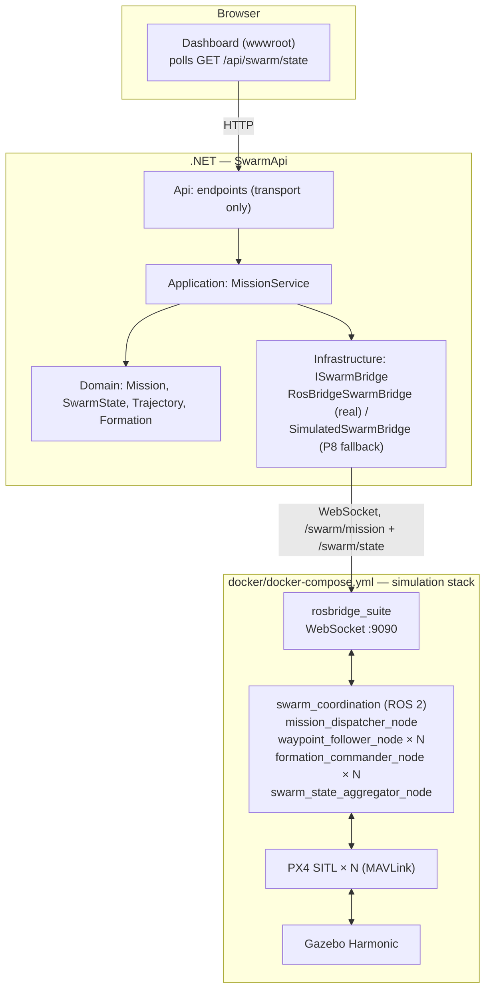

# swarmsim

[](https://github.com/konradcinkusz/swarmsim/actions/workflows/ci.yml)
[](LICENSE)

A drone-swarm simulation and coordination platform, built on existing open-source
flight-simulation engines — Gazebo, PX4 SITL, ROS 2 — rather than a custom physics
engine, with a .NET backend exposing mission-definition and swarm-state REST APIs as
the integration point for a future natural-language mission layer.

This repository covers the **foundational phase**: bring up a multi-drone simulation,
give it basic swarm coordination (waypoint following, leader-follower formation), and
put an API and a dashboard in front of it. A natural-language mission layer (M5) is
explicitly out of scope here — see [Milestones](#milestones).

## Architecture



Two composition roots, one per layer, and why — see
[`docs/adr/0002-composition-root-split.md`](docs/adr/0002-composition-root-split.md):

- **`docker/docker-compose.yml`** brings up the simulation stack.
- **`dotnet run --project backend/src/SwarmApi.Api`** brings up the API — no simulation
  stack required: with `RosBridge:Url` unset or unreachable, it falls back to a
  deterministic in-memory swarm (see
  [`docs/adr/0003-rosbridge-degrade-pattern.md`](docs/adr/0003-rosbridge-degrade-pattern.md)).

Full architecture, the compliance checklist against
[`architecture-standards`](https://github.com/konradcinkusz/architecture-standards), and
every recorded deviation with its reasoning: [`docs/architecture/`](docs/architecture/).

## Milestones

| # | Scope | Status |
|---|---|---|
| M0 | Docker Compose environment; one drone (x500) spawns in Gazebo, responds to `commander takeoff` | Implemented; **runtime verified manually only** — see [note](#m0-manual-verification) |
| M1 | 3-5 PX4 SITL instances in one world, namespaced ROS 2 topics per drone | Implemented (`simulation/px4-configs/`, `docker/entrypoint.sh`); manual verification, same as M0 |
| M2 | Waypoint-following and leader-follower formation, no collisions | Implemented, unit tested (`swarm_coordination/`, `backend/.../Formation.cs`) |
| M3 | `POST /api/missions`, `GET /api/swarm/state`, < 1s state latency | Implemented, integration tested against the simulated bridge (`backend/tests/SwarmApi.Api.Tests`) |
| M4 | Real-time swarm status readable without a terminal | Implemented (`backend/src/SwarmApi.Api/wwwroot/`) |
| M5 | Natural-language mission layer | Out of scope for this repository's current phase |

<a name="m0-manual-verification"></a>
**Why "manually only":** `docker/Dockerfile.sim` compiles PX4 from source against
Gazebo and needs GPU/X11 access for its GUI acceptance criterion — this sandbox's own
CI cannot build or run it (verified directly; see
[`docs/adr/0004-ci-scope-for-simulation-stack.md`](docs/adr/0004-ci-scope-for-simulation-stack.md)
for exactly what CI does validate instead: Dockerfile lint, compose config, world file
well-formedness). M2's collision-avoidance and M3's API behavior, in contrast, are
fully covered by automated tests, because both are provable against pure logic and the
simulated bridge without needing Gazebo to actually be running.

## Quickstart — M0: one drone in Gazebo

**Prerequisites:**

- Docker with Compose v2 (`docker compose version`)
- Linux, or Windows via WSL2 (Ubuntu 22.04/24.04)
- For the GUI: X11 (native Linux) or WSLg (Windows 11 WSL2); check GPU support first
  with `vulkaninfo` or `glxinfo | grep OpenGL`. No GPU? Use headless mode below —
  the simulation still runs and answers MAVLink commands, just without a visible window.

```bash
cd docker

# GUI mode (default) — needs X11/WSLg passthrough:
xhost +local:docker   # Linux only, allows the container to use your X server
docker compose up --build

# Headless mode — no GPU/display required, telemetry only:
HEADLESS=1 docker compose up --build
```

First build compiles PX4 from source against ROS 2 Humble and Gazebo Harmonic — this
is normal and can take 15-40 minutes the first time; subsequent runs reuse the image.

**Verify the drone responds to a command**, in a second terminal — each PX4 instance
runs in its own named `tmux` session (see `docker/entrypoint.sh`), so attaching reaches
the real interactive PX4 console (`pxh>`), not a backgrounded process with no console:

```bash
docker compose exec sim tmux attach -t drone_1
# at the pxh> prompt:
commander takeoff
# detach without stopping the drone: Ctrl+B, then D
```

You should see `drone_1` climb in the Gazebo window (GUI mode) or the console's
telemetry (headless mode) report an altitude change. That is M0's acceptance criterion,
met. (`docker compose exec sim tmux ls` lists every running instance's session name.)

**Multiple drones (M1):** `simulation/px4-configs/` ships five per-drone configs
(`drone_1.env` … `drone_5.env`); `docker/entrypoint.sh` spawns one PX4 SITL instance per
file it finds, already namespaced (`drone_1` … `drone_5`). Nothing to configure — it is
the same container image and command as M0, just with more `.env` files present.

## Quickstart — the API and dashboard (M3/M4)

No simulation stack required — the API falls back to a simulated swarm (P8):

```bash
cd backend
dotnet run --project src/SwarmApi.Api
```

Open `http://localhost:5000` (or the port `dotnet run` prints) for the dashboard, or:

```bash
curl -s http://localhost:5000/health | jq
curl -s -X POST http://localhost:5000/api/missions \
  -H 'Content-Type: application/json' \
  -d '{
        "name": "Perimeter sweep",
        "type": "waypoint",
        "waypoints": [{"x":0,"y":0,"z":5}, {"x":10,"y":0,"z":5}],
        "droneCount": 3,
        "spacingMeters": 2.0
      }' | jq

curl -s http://localhost:5000/api/swarm/state | jq
```

**Against a real simulation:** set `RosBridge__Url=ws://localhost:9090` (or run both
via `docker compose up` in `docker/`, which wires this automatically —
see `docker/docker-compose.yml`). `GET /health` reports which mode is active
(`swarmBridge: "Connected" | "Simulated"`).

## Repository layout

| Path | What it is |
|---|---|
| `docker/` | Composition root for the simulation stack (Gazebo/PX4/ROS 2) + the API's Dockerfile |
| `simulation/` | Gazebo worlds, per-drone PX4 SITL configs |
| `swarm_coordination/` | ROS 2 (ament_python) package: waypoint/formation logic + node adapters |
| `backend/` | .NET solution: `SwarmApi.Domain/Application/Infrastructure/ServiceDefaults/Api` |
| `docs/adr/` | Architectural decision records |
| `docs/architecture/` | Compliance checklist against `architecture-standards`, open deviations register |

## Development

```bash
# .NET
cd backend && dotnet test SwarmPlatform.sln

# Python (swarm_coordination pure logic; no ROS 2 install required)
cd swarm_coordination && ruff check . && pytest

# Simulation config (no GPU/build required)
docker compose -f docker/docker-compose.yml config -q
```

All three run in CI on every push and pull request (`.github/workflows/ci.yml`), along
with Dockerfile linting (`hadolint`) and secret scanning (`gitleaks`).

## Standards

This repository follows
[`konradcinkusz/architecture-standards`](https://github.com/konradcinkusz/architecture-standards)
where it applies to a robotics simulation platform, and documents every place it
deliberately doesn't — see [`docs/architecture/`](docs/architecture/) and
[`docs/adr/`](docs/adr/) for the reasoning behind each decision, not just the outcome.

## License

MIT — see [`LICENSE`](LICENSE).
