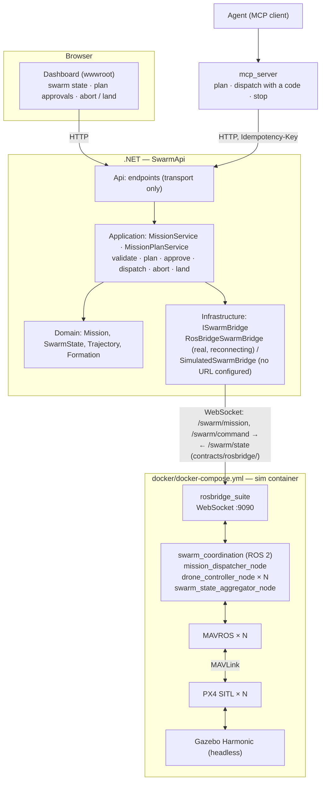

# swarmsim

A drone-swarm simulation and coordination platform, built on existing open-source
flight-simulation engines — Gazebo, PX4 SITL, ROS 2 — rather than a custom physics
engine, with a .NET backend exposing mission-definition and swarm-state REST APIs as
the integration point for a future natural-language mission layer.

This site covers the architecture and the reasoning behind it. For clone-and-run
instructions, the full tutorial, the troubleshooting table, and the dependency
inventory, see the
[repository README](https://github.com/konradcinkusz/swarmsim#readme) — that stays the
single source of truth for "how do I run this."

## Architecture

Two composition roots, one per layer — `docker/docker-compose.yml` for the simulation
stack (and the API wired to it), `dotnet run` for the API alone, running a deterministic
in-memory swarm when no simulation is configured. A configured simulation that is
unreachable is reported as `Disconnected`, never replaced by the simulated one. See
[ADR-0002](adr/0002-composition-root-split.md) and [ADR-0003](adr/0003-rosbridge-degrade-pattern.md).

## Milestones

| # | Scope | Status |
|---|---|---|
| M0 | One drone (x500) spawns in Gazebo, responds to `commander takeoff` | Implemented; flown by the SITL smoke job |
| M1 | 3-5 PX4 SITL instances, namespaced ROS 2 topics per drone | Implemented; the SITL smoke job flies three |
| M2 | Waypoint-following and leader-follower formation, no collisions | Implemented, unit tested; flown by the SITL smoke job |
| M3 | Missions in, swarm state out, abort and land-all, < 1s state latency | Implemented, integration tested; flown by the SITL smoke job, p95 state age 0.2 s |
| M4 | Real-time swarm status readable without a terminal | Implemented |
| M5 | Natural-language mission layer | Not built; its gate is — an agent plans through MCP, a person approves ([ADR-0009](adr/0009-agent-write-gate.md)) |

## Where to go next

- **[Architecture overview](architecture/README.md)** — the compliance checklist against
  [`architecture-standards`](https://github.com/konradcinkusz/architecture-standards)
  and the layering this repo follows.
- **[Open deviations](architecture/DEVIATIONS.md)** — every place this repo doesn't yet
  meet that constitution, with the reasoning and the trigger to close it.
- **[Decision records](adr/0001-simulation-stack-selection.md)** — one ADR per
  architectural choice, including the ones that depart from the standard on purpose.
- **[API surface](architecture/API-SURFACE.md)** — every endpoint, classified as read,
  plan, approval, gated write, write or stop, with what it needs in Enforced mode.
- **[Scenario study](research/scenario-study.md)** — what the scenario instrument found
  when it flew the swarm through wind, comms loss, battery faults and ten drones, and
  whether the scenarios would notice a regression.
- **[Source on GitHub](https://github.com/konradcinkusz/swarmsim)** — code, issues, and
  the [README tutorial](https://github.com/konradcinkusz/swarmsim#readme).
